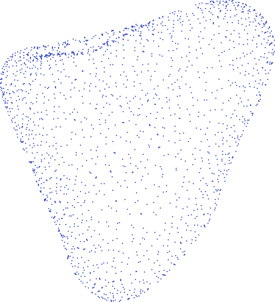
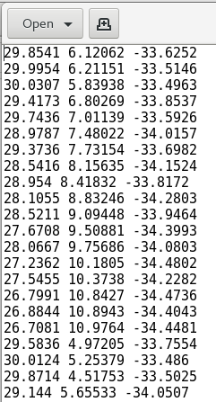
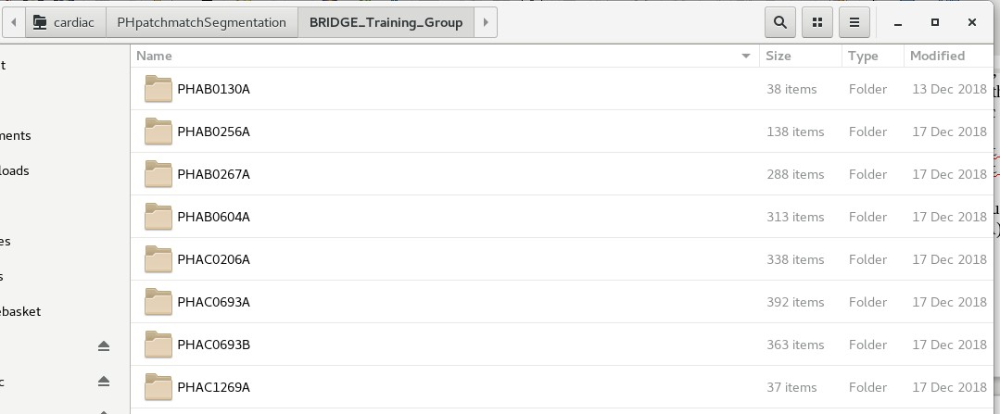
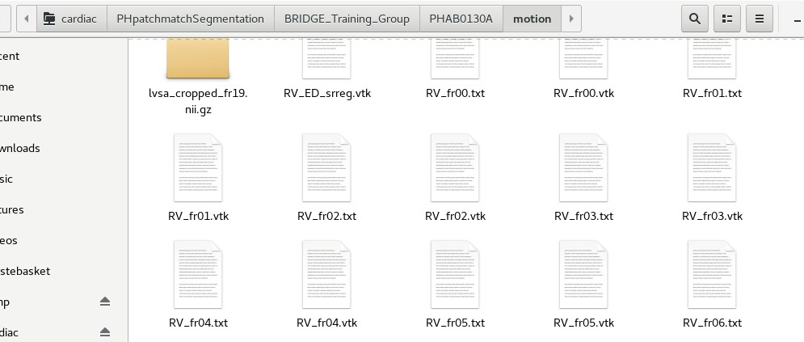
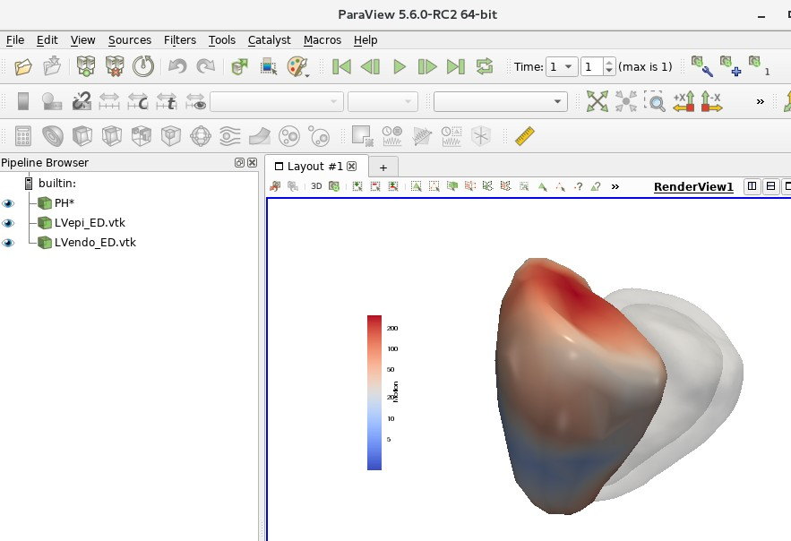
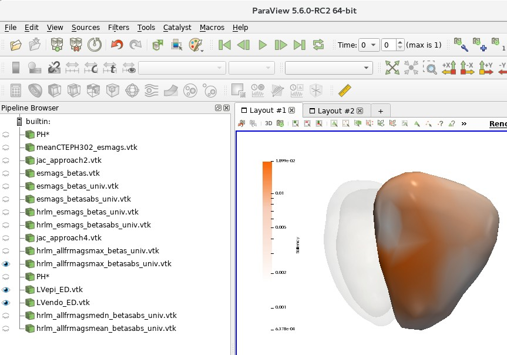

 

# 4DSurvival in PH
Neural network that predicts survival using mesh motion data

## 1. Mesh motion data

Mesh motion data can be thought of as snapshots of the right ventricle (RV) at 20 time points in the cardiac cycle. Motion of the RV is described by these 20 meshes. Each mesh is a point cloud consisting of (usually) 18,028 points (henceforth referred to as vertices), each representing some anatomical location on the heart:

Each mesh is described by a text file that simply lists the Cartesian (x,y,z) coordinates of each of its 18,028 vertices. Below is a short excerpt of a **mesh coordinate file**: 

 As the figure shows, each row in the text file represents the x,y,z coordinates of a vertex in the mesh.

 

As mentioned, the motion of the RV through one cardiac cycle is represented by 20 meshes, each one akin to a ‘snapshot’ of the RV at some point in the cardiac cycle. Therefore, for each subject, there will be 20 meshes, and their corresponding coordinate files are named as follows: `RV_fr00.txt` (mesh 0), `RV_fr01.txt` (mesh 1), `RV_fr02.txt` (mesh 2), etc. all the way to `RV_fr19.txt` (mesh 19). For each subject, these files are stored in a directory called ‘**motion**’, which is a sub-directory of a folder named with the subject’s ID. The mesh data for all subjects are stored in the following folders on the cardiac$ drive:

 `~/cardiac/PHpatchmatchSegmentation/BRIDGE_Training_Group`

`~/cardiac/PhpatchmatchSegmentation/BRIDGE_Test_Group`

 Navigate to any one of these folders. You should be able to see a list of sub-folders, each named with an alphanumeric code (e.g. PHAB0130A). You should see something like below:

 

Each folder is named after an individual subject/patient ID. These alphanumeric IDs are random IDs assigned to the patients to preserve anonymity. Under each subject’s folder, there should be a sub-folder called ‘motion’, which contains the mesh coordinate files. See below for an example:

 

In order to train 4DSurvival, the data from these mesh coordinate files will be used. In a later section, we will describe how to read the data from these files and construct a mesh motion matrix that can be fed into the 4DSurvival network. Note that 4DSurvival also requires survival outcome data for training. This will be data on each subject providing the length of their observation period (starting from the date of MRI scan) and their status (dead/alive) at the end of the observation period. For all patients, this information is stored under the following directory: 

`~/cardiac/BRIDGE/BRIDGE Patients` 

The spreadsheets containing the information are BRIDGE Training Group.xlsx and BRIDGE Test Group.xlsx. **NOTE: these Excel files are password-protected. Please contact Ghalib Bello (ghalibbello@gmail.com) or Dr. Timothy Dawes (tim.dawes@imperial.ac.uk) for the password.** In these files, there is also data on covariates such as age, sex, WHO functional class, etc.

  

## 2. Processing mesh motion data for use in 4DSurvival

The 4DSurvival network is constructed and trained in Python. The mesh motion data is fed into this network as a large matrix of size *n* x *p* (where *n* is the number of subjects and *p* is the number of features). The number of features *p* is typically 11,514 (=19 timepoints x 202 vertices x 3 coordinates [x, y and z]). Note, we down-sample the meshes (from 18,028 vertices down to 202) before using them in 4DSurvival. See the NMI paper for a more detailed description of the input data format.

The python scripts below are used to process the mesh motion data, and also to select the subset of patients we used in the NMI paper. Please peruse them to understand how they read, process and downsample the data:

 

1. `~/cardiac/for_ghalib/backup/home/gbello@isd.csc.mrc.ac.uk/gbello/R Workspace1/mesh_sandbox_cleaned.py`

2. `~/cardiac/for_ghalib/backup/home/gbello@isd.csc.mrc.ac.uk/gbello/R Workspace1/mesh_motiondescriptor_PHAB0267Adecmesh_CTEPH302.py`

The end-product of these scripts is a pickle file (https://docs.python.org/3/library/pickle.html) that can be found in:

`~/cardiac/for_ghalib/backup/home/gbello@isd.csc.mrc.ac.uk/gbello/R Workspace1/mesh_motiondescriptor_PHAB0267Adecmesh_CTEPH302.pkl`

which contains:

1. processed mesh motion data

2. survival outcome data

3. list of subject IDs

## 3. Training and Validating 4DSurvival

The training and validation of 4DSurvival is carried out in a Python script that reads the data from `mesh_motiondescriptor_PHAB0267Adecmesh_CTEPH302.pkl` (from Section 2 above). The Python script can be found at:

`~/cardiac/for_ghalib/backup/home/gbello@isd.csc.mrc.ac.uk/gbello/R Workspace1/CVtests_CTEPH_SSARVandconvCOMP_bootstrap_corr2_PHAB0267 Adecmesh_NMI.py`

The output of this script (containing training and validation statistics, predicted scores, information on which subjects were selected in each bootstrap sample, etc.) is stored in:

`~/cardiac/for_ghalib/backup/home/gbello@isd.csc.mrc.ac.uk/gbello/R Workspace1/CVtests_CTEPH_SSAERVandconvCOMP_bootstrap_corrPHAB0267A decmesh_NMI_fullrun_evals50_B100_wAlpha_pickle2.pkl`

In addition, the saved model is located in:

`~/cardiac/for_ghalib/backup/home/gbello@isd.csc.mrc.ac.uk/gbello/R Workspace1/CVtests_CTEPH_SSAERVandconvCOMP_bootstrap_corrPHAB0267A decmesh_fullrun_saved_model.h5`

This saved model can be used later to generate predictions for new patients, or to study the network weights and layers in more detail.

The neural network architecture is a supervised autoencoder, constructed using the deep learning library *Keras* ([https://keras.io](https://keras.io/)). For full details about the network, and the training and validation technique, see the NMI paper and also the Jupyter notebooks in [https://github.com/UK-Digital-](https://github.com/UK-Digital-Heart-Project/4Dsurvival/tree/master/demo) [Heart-Project/4Dsurvival/tree/master/demo](https://github.com/UK-Digital-Heart-Project/4Dsurvival/tree/master/demo).

## 4. Training and Validating conventional parameter model

As an alternative to using detailed 3D mesh motion to predict survival, simple conventional parameters (derived from a Cardiac MRI scan) could also be used, e.g. RV Ejection Fraction (RVEF), RV End Diastolic Volume (RVEDV) and RV End Systolic Volume (RVESV). We will later (in a subsequent section) compare the predictive performance of such a model to that of 4DSurvival which uses high-resolution meshes. See NMI paper for details.

The conventional parameter model is trained using a [Cox Proportional Hazards Model](https://en.wikipedia.org/wiki/Proportional_hazards_model#The_Cox_model), a type of statistical model for handling censored time-to-event data. The script that implements this (trains and validates the model) is:

`~/cardiac/for_ghalib/backup/home/gbello@isd.csc.mrc.ac.uk/gbello/R Workspace1/CodeOcean/code/lib/demo_validate_2018Dec17.py`

The output of this script (containing training and validation statistics, predicted scores, etc.) is stored in a pickle file located at:

`~/cardiac/for_ghalib/backup/home/gbello@isd.csc.mrc.ac.uk/gbello/R Workspace1/bootout_conv_B100_2018Dec17_298451.pkl`

  

## 5. Training and Validating strain model

As an alternative to using detailed mesh motion to predict survival, mesh strain parameters can instead be used (see NMI paper for more details). A model utilizing just strain parameters is trained using a Cox Proportional Hazards Model. The script that implements this (trains and validates the model) is:

`~/cardiac/for_ghalib/backup/home/gbello@isd.csc.mrc.ac.uk/gbello/R Workspace1/CodeOcean/code/lib/demo_validate_Strain.py`

The output of this script (containing training and validation statistics, predicted scores, etc.) is stored in a pickle file located at:

`~/cardiac/for_ghalib/backup/home/gbello@isd.csc.mrc.ac.uk/gbello/R Workspace1/strain_demo_validate_run1.pkl`

## 6. Training and Validating ‘3D + all covariates’ parameter model

We combined the 3D mesh motion data with covariates into the same model. See NMI paper for more details.

The script for training and validating this model is located in:

`~/cardiac/for_ghalib/backup/home/gbello@isd.csc.mrc.ac.uk/gbello/R Workspace1/CVtests_CTEPH_CoxwNet_boot_4NMIrevision_CoxwCovs4_corr.py`

The output of this script (containing training and validation statistics, predicted scores, etc.) is stored in a pickle file located at:

`~/cardiac/for_ghalib/backup/home/gbello@isd.csc.mrc.ac.uk/gbello/R Workspace1/CVtests_CTEPH_CoxwNet_boot_4NMIrevision_CoxwCovs4_run4.pkl`

## 7. Model Comparisons

The above models (Sections 4-6) are compared to 4DSurvival with respect to predictive accuracy (see NMI paper for details):

- 4DSurvival vs. Conventional Parameter model
- 4DSurvival vs. Strain parameter model
- 4DSurvival vs. ‘3D + all covariates’ model

These model comparisons are carried out in the following R script:

`~/cardiac/for_ghalib/backup/home/gbello@isd.csc.mrc.ac.uk/gbello/R Workspace1/CVtests_CTEPH_SSARVandconvCOMP_bootstrap_corr_POSTPROCE SSING_post_wlogrank_newNMIrevision_documentation.R`

 

## 8. Model Interpretation

Figures 3A and 3B in the paper show visualizations of the latent layer in the 4Dsurvival network and a saliency map describing the contribution of various areas of the RV to overall predictive accuracy (see NMI paper for more details). Figures 3A and 3B can be reproduced using the following script:

`~/cardiac/for_ghalib/backup/home/gbello@isd.csc.mrc.ac.uk/gbello/R Workspace1/Latent_Space_Interpolation_clean.py`

In Figure 3A, in addition to the scatter plot, there are 2 RV meshes indicating healthy and unhealthy subjects. These can be viewed in Paraview. Open Paraview then File > Load State. In the file selection window, open file:

`~/cardiac/for_ghalib/backup/home/gbello@isd.csc.mrc.ac.uk/gbello/R Workspace1/PaperPlotData_Figure3A_UnhealthyHealthy_PHAH1207Aind10P HKT0473Aind163_allfrmags_mean wlogcolorscale_UPDforLinuxMachine.p vsm`

A dialog box **might** open asking to ‘Load State Options’. Choose ‘Use File Names From State’. The following should show:

 

In the Pipeline Browser, element PH* represents the RVs of the healthy and unhealthy hearts. To toggle between healthy and unhealthy RV, use the ‘Previous Frame’ and ‘Next Frame’ buttons on the top panel.

 

Figure 3B is also generated by the aforementioned Python script (`Latent_Space_Interpolation_clean.py`). The resulting saliency map can be viewed in Paraview (following the same procedure above) using the saved state:

`~/cardiac/for_ghalib/backup/home/gbello@isd.csc.mrc.ac.uk/gbello/R Workspace1/PaperPlotData_ColorScale_SaveState_UPDforLinuxMachine.pvsm`

 

  

## 9. Supplementary Material

Below are brief descriptions of the analyses carried out in the Supplementary Information section of the NMI paper. See the paper for descriptions of these analyses:

### (a) Down-sampling of the 3D mesh

- DL network fitted on data consisting of meshes with 101 vertices:

  - Script for training and validating the network:

    `[~/cardiac/for_ghalib/backup/home/gbello@isd.csc.mrc.ac.u](mailto:~/cardiac/for_ghalib/backup/home/gbello@isd.csc.mrc.ac.u) k/gbello/RWorkspace1/CVtests_NMIRevision_fresh_codeOcean_wstd_nestedCVnew_vtx100.py`

  - Input data to the script: this contains the motion data for the 101-vertex meshes, and also the corresponding survival outcome data:

    `~/cardiac/for_ghalib/backup/home/gbello@isd.csc.mrc.ac.uk/gbello/RWorkspace1/mesh_motiondescriptor_PHAB0267Adecmesh_CTEPH302_vtx100_pickle2.pkl`

  - Output data: The output of this script (containing training and validation statistics, predicted scores, etc.) is stored in a pickle file located at:

    `[~/cardiac/for_ghalib/backup/home/gbello@isd.csc.mrc.ac.u](mailto:~/cardiac/for_ghalib/backup/home/gbello@isd.csc.mrc.ac.u) k/gbello/RWorkspace1/CVtests_NMIRevision_fresh_CodeOcean_wstd_nestedCV_vtx100_run1_pickle2.pkl`

- DL network fitted on data consisting of meshes with 501 vertices*:

  - Script for training and validating the network:

    `~/cardiac/for_ghalib/backup/home/gbello@isd.csc.mrc.ac.u](mailto:~/cardiac/for_ghalib/backup/home/gbello@isd.csc.mrc.ac.u) k/gbello/RWorkspace1/CVtests_NMIRevision_fresh_codeOcean_wstd_nestedCV_vtx500.py`

  - Input data to the script: this contains the motion data for the 501-vertex meshes, and also the corresponding survival outcome data:

    `~/cardiac/for_ghalib/backup/home/gbello@isd.csc.mrc.ac.u](mailto:~/cardiac/for_ghalib/backup/home/gbello@isd.csc.mrc.ac.u) k/gbello/RWorkspace1/mesh_motiondescriptor_PHAB0267Adecm esh_CTEPH302_vtx500_pickle2.pkl`

  - Output data: The output of this script (containing training and validation statistics, predicted scores, etc.) is stored in a pickle file located at:

    `~/cardiac/for_ghalib/backup/home/gbello@isd.csc.mrc.ac.u](mailto:~/cardiac/for_ghalib/backup/home/gbello@isd.csc.mrc.ac.u) k/gbello/RWorkspace1/CVtests_NMIRevision_fresh_CodeOcean_wstd_nestedCV_vtx500_run1_pickle2.pkl`

### (b)  Using coordinate data for prediction

- DL network fitted using coordinate data (rather than displacement data)*:

  - Script for training and validating the network:

`~/cardiac/for_ghalib/backup/home/gbello@isd.csc.mrc.ac.u](mailto:~/cardiac/for_ghalib/backup/home/gbello@isd.csc.mrc.ac.u) k/gbello/RWorkspace1/CVtests_NMIRevision_fresh_codeOcean_wstd_nestedCV_xyznotdisp.py`

  - Input data to the script: this contains the raw coordinate data, and also the corresponding survival outcome data:

    `~/cardiac/for_ghalib/backup/home/gbello@isd.csc.mrc.ac.u](mailto:~/cardiac/for_ghalib/backup/home/gbello@isd.csc.mrc.ac.u) k/gbello/RWorkspace1/mesh_motiondescriptor_PHAB0267Adecm esh_CTEPH302_xyznotdisp_pickle2.pkl`

  - Output data: The output of this script (containing training and validation statistics, predicted scores, etc.) is stored in a pickle file located at:

    `~/cardiac/for_ghalib/backup/home/gbello@isd.csc.mrc.ac.u](mailto:~/cardiac/for_ghalib/backup/home/gbello@isd.csc.mrc.ac.u) k/gbello/RWorkspace1/CVtests_NMIRevision_fresh_CodeOcean_wstd_nestedCV_xyznotdisp_run1_pickle2.pkl`

### (c)  Cross-validation vs. Bootstrap internal validation

- Script that trains and validates 4DSurvival using nested cross-validation (rather than bootstrap):

    `~/cardiac/for_ghalib/backup/home/gbello@isd.csc.mrc.ac.uk/g bello/RWorkspace1/CVtests_NMIRevision_fresh_codeOcean_wstd_ nestedCVnew5_reptest.py`

- Input data to the script:

    `~/cardiac/for_ghalib/backup/home/gbello@isd.csc.mrc.ac.uk/g bello/RWorkspace1/mesh_motiondescriptor_PHAB0267Adecmesh_CT EPH302_pickle2.pkl`

- Output data: The output of this script (containing training and validation statistics, predicted scores, etc.) is stored in a pickle file located at:

    `~/cardiac/for_ghalib/backup/home/gbello@isd.csc.mrc.ac.uk/g bello/RWorkspace1/CVtests_NMIRevision_fresh_CodeOcean_wstd_ nestedCVnew_run5_reptest_pickle2.pkl`

All these models in the Supplementary Materials section were validated using a model validation approach called nested cross-validation (see NMI paper for more details). Model predictive accuracy is computed in the following R script:

`~/cardiac/for_ghalib/backup/home/gbello@isd.csc.mrc.ac.uk/gbello/R Workspace1/nestedCV_compare_newNMIrevision_documentation.R`

## 10. Programming Environment

All of my code is written in Python and R. Data wrangling was done mostly with R and Python (largely using Python libraries pandas and NumPy). All the scripts are stored under:

`~/cardiac/for_ghalib/backup/home/gbello@isd.csc.mrc.ac.uk/gbello/R Workspace1`

The bulk of the work was done in Windows and a GPU-enabled Linux machine. Additional work was done on our high-performance clusters Eddie and Marvin. These systems (both Linux-based) can be accessed from local PCs onsite, e.g. from a Windows machine, Marvin can be accessed by following the instructions found in:

`~/cardiac/Marvin/How to Start Marvin.docx`

From a local Linux machine on-site, Eddie or Marvin can be accessed via:

`ssh <username>@eddie ssh <username>@marvin`

where <username> is your username on these systems. 

### Working with R

The program Rstudio provide self-contained development environments for writing, testing and running R code. Package installation is straightforward:

`install.packages(‘<package name>’)`

 

### Working with Python

For this work, it helps to set up Python within a virtual environment. There are different software packages for setting up virtual environments. Below is an example using one such software (Miniconda). We assume the operating system is Linux.

1. Download Miniconda for Linux (https://docs.conda.io/en/latest/miniconda.html). The download should be a bash script (with .sh extension)

2. To set up Miniconda, follow the instructions on this page (https://conda.io/projects/conda/en/latest/user-guide/install/linux.html)

3. The next step would be to create a new environment, which can be done following instructions at [https://conda.io/projects/conda/en/latest/user-guide/tasks/manage-](https://conda.io/projects/conda/en/latest/user-guide/tasks/manage-environments.html#creating-an-environment-with-commands) [environments.html#creating-an-environment-with-commands](https://conda.io/projects/conda/en/latest/user-guide/tasks/manage-environments.html#creating-an-environment-with-commands). The environment can be set up with some version of Python 3.x (e.g. Python 3.5).

4. If you haven’t already, activate the new environment by: `source activate <the new environment name>`

5. Within the new environment, it is straightforward to install required Python libraries (e.g. numpy, pandas) using `conda install <library name>` or using `pip install <library name>`.
